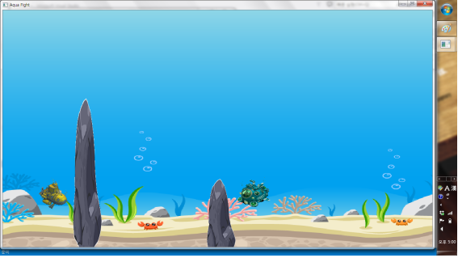
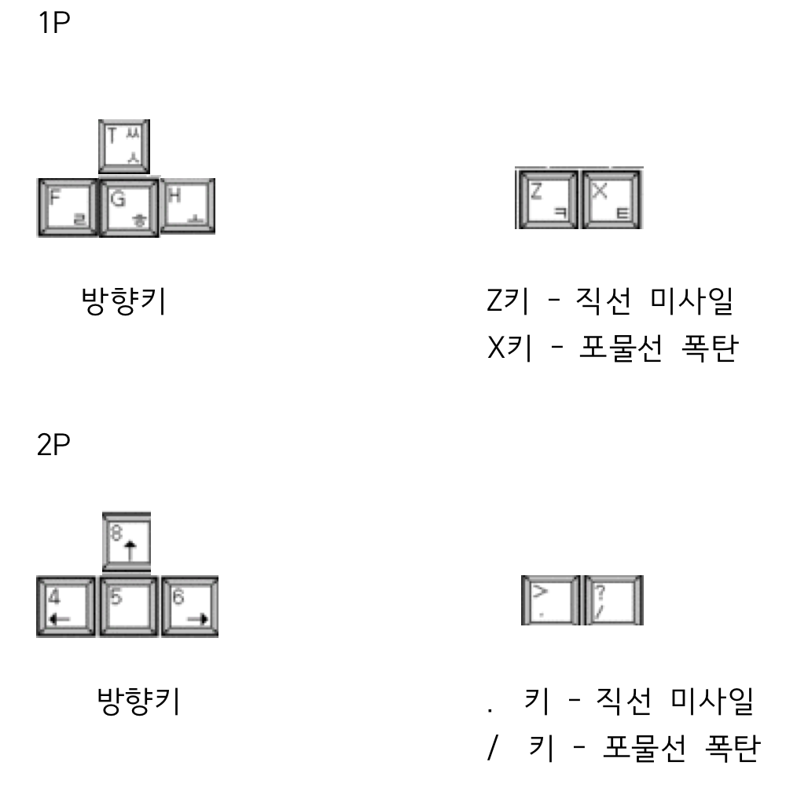
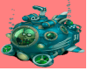
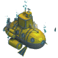
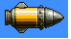
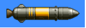

# aquaFight-C-WinAPI
> _C와 WinAPI_ 를 이용해 만든 윈도우 어플리케이션입니다.
[](license.txt)




## 프로젝트 설명

Win API를 배우며 진행한 학기말 프로젝트입니다.
<br>2명이서 개발했으며 '아쿠아대전' 이라는 아케이드 게임입니다.

## 게임 설명
- 게임 이름 : 아쿠아 대전 (Aqua War)

- 게임 장르 : 아케이드 게임

- 게임 방식 : 2인용(2P) 게임으로 진행되며 서로 자신의 잠수정을 움직이면서 미사일과 폭탄을 쏨으로서 적을 맞춰서 격추시키는 게임. 미사일에 맡으면 HP가 감소되며 HP가 다 감소되면 격추된다.

- 게임 목표 : 상대방 잠수정을 격추하면 승리.

## 조작 방법



## 구현 내용

### 중심 구현 내용

1) 비트맵 구현
비트맵 이미지를 이용해서 맵 및 캐릭터(잠수함) 띄우기




<br><br><br>
<br>
<br>

2)  움직임 구현

- 처음 기본 면에서는 1P는 왼쪽 끝 세로 중앙 2P는 오른쪽 끝에 세로 중앙에 위치.<br>

- 다른 아케이드 게임과 마찬가지로 상하 좌우로 키를 입력을 받아서 움직인다.<br> 
물속에서 움직이는 것을 감안하여 키를 떼도 바로 멈추는 것이 아닌 속도가 점점 줄어들다가 멈추게 구현.
자연스러운 움직임을 위해 선형적으로 속도가 증가하는게 아닌 sin 함수를 이용해 점점 많이 증가하게 구현을 함. 

- 일정 속력이 되면 더 이상 속력은 증가하지 않는다.<br>

- GetAsyncKeyState 함수를 이용해 2개 키 입력을 가능하게 해 8개의 방향으로 이동이 가능함.<br>

3) 무기 구현

- 두 개의 무기를 구현함. 1개는 직선으로 가는 미사일, 나머지 1개는 아래에서 위로 사선으로 올라가는 미사일 구현. 미사일은 어뢰가 발사되는 것처럼 일정 거리를 아래로 내려 간 후 발사.<br>

- 미사일 가속도도 sin 함수를 이용해 선형적이 아닌 점점 증가하게 구현.<br>

4) 충돌 체크 구현

- 캐릭 자체간의 충돌체크<br>
캐릭 끼리 부딪히면 서로 뒤로 튕겨져 나간다.

- 캐릭과 무기와의 충돌체크<br>
무기의 발사방향으로 캐릭터가 튕겨져 나간다.

5) 애니메이션 구현

- 캐릭터(잠수함)이 움직일 시 뒤에 거품 애니메이션<br>
- 미사일이 날아 갈 시 뒤에 불 애니메이션<br>

### 팀원 역할

- 장성우: 물체 이동구현, 폭탄 및 미사일 이동 구현(물리 적용), 애니메이션 구현
- 목태수: 리소스(비트맵) 구하기, 맵 구현, 충돌체크 구현

## 실행 방법


1. [git clone](https://github.com/jangseongwoo/aquaFight-C-WinAPI.git) 을 하세요.
```sh
git clone https://github.com/jangseongwoo/aquaFight-C-WinAPI.git
```

2. Visual studio의 프로젝트 열기로  aquaFight  _WinGame_ 폴더를 열어주세요.

3. Visual studio로 프로젝트를 컴파일 및 빌드 해주시면 실행됩니다.

## 개발 환경

- 사용 OS : 윈도우7 64bit
- 개발 툴 : Visual Studio 2013

## 정보

프로젝트에 대한 더 자세한 정보를 원하신다면,  aquaFight 폴더 내에 있는 _윈플최종보고서.hwp_ 를 참조해주세요.

장성우 – [@facebook](https://www.facebook.com/profile.php?id=100007028118707&ref=bookmarks) – seongwoo.dev@gmail.com

MIT 라이센스를 준수하며 ``LICENSE``에서 자세한 정보를 확인할 수 있습니다.

[https://github.com/jangseongwoo/github-link](https://github.com/jangseongwoo/github-link)

<!-- Markdown link & img dfn's -->
[npm-image]: https://img.shields.io/npm/v/datadog-metrics.svg?style=flat-square
[npm-url]: https://npmjs.org/package/datadog-metrics
[npm-downloads]: https://img.shields.io/npm/dm/datadog-metrics.svg?style=flat-square
[travis-image]: https://img.shields.io/travis/dbader/node-datadog-metrics/master.svg?style=flat-square
[travis-url]: https://travis-ci.org/dbader/node-datadog-metrics
[wiki]: https://github.com/yourname/yourproject/wiki
